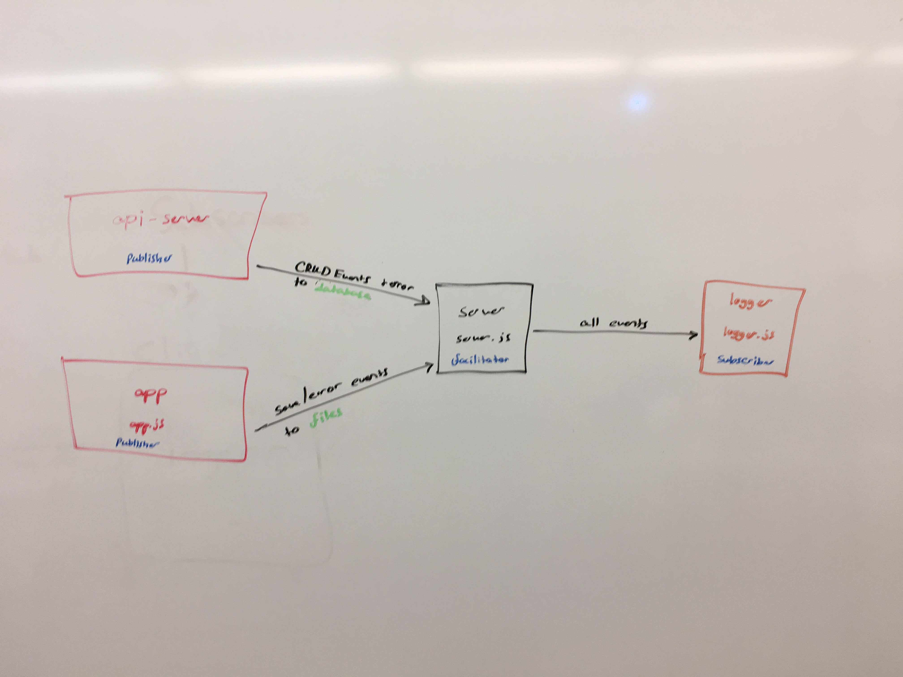

# LAB - 19

## Socket.io - Message Queue Server

### Author: Michael

### Links and Resources
* [submission PR](https://github.com/michaelchapman-401-advanced-javascript/lab-19-server/pull/1)
* [travis](https://travis-ci.org/michaelchapman-401-advanced-javascript/lab-19-server)

### Modules
#### `server.js`
##### Monitors incoming events

### Setup
#### `.env` requirements
* PORT

#### Running the app
* `node server.js`

#### Tests
* npm test

#### UML

